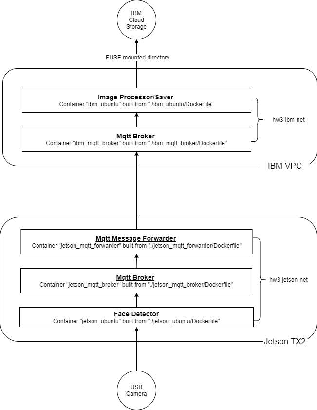

## Homework 3 - Internet of Things 101

### Assignment Requirements

* Use OpenCV and write an application that scans the video frames from the connected USB camera for faces
* Cut the faces out of the frame if detected and send it to a local MQTT broker via a binary message
* Receive the message from a local MQTT broker and forward it to a Cloud MQTT broker
* Save the message (converted back to a picture format) in a Cloud Storage

Suggested architecture diagram:  


### Overview of My Implementation

I created five docker containers, three on Jetson TX2 and two on IBM VPC.
1. jetson_ubuntu
    * Built using `./jetson_ubuntu/Dockerfile`
    * Attached to a user-defined network called `hw3-jetson-net`
    * `./jetson_ubuntu/face_reg.py` is executed in this container to scan videos, detect faces, and publish binary messages to a local MQTT broker `jetson_mqtt_broker`.
2. jetson_mqtt_broker
    * Built using `./jetson_mqtt_broker/Dockerfile`
    * Attached to a user-defined network called `hw3-jetson-net`
    * `./jetson_mqtt_broker/mosquitto.conf` is executed in this container.
3. jetson_mqtt_forwarder
    * Built using `./jetson_mqtt_forwarder/Dockerfile`
    * Attached to a user-defined network called `hw3-jetson-net`
    * `./jetson_mqtt_forwarder/mqtt_subscriber_local.py` is executed in this container to subscribe messages and publish them to a Cloud MQTT broker `ibm_mqtt_broker`, whose public IP is `52.117.20.245`.
4. ibm_mqtt_broker
    * Built using `./ibm_mqtt_broker/Dockerfile`
    * Attached to a user-defined network called `hw3-ibm-net`
    * `./ibm_mqtt_broker/mosquitto.conf` is executed in this container.
5. ibm_ubuntu
    * Built using `./ibm_ubuntu/Dockerfile`
    * Attached to a user-defined network called `hw3-ibm-net`
    * Directory `/mnt/mybucket` is FUSE mounted onto [a bucket](https://cos-w251-standard-hw3.s3.us-south.cloud-object-storage.appdomain.cloud)
    * `./ibm_ubuntu/mqtt_subscriber_remote.py` is executed in this container to subscribe messages, decode messages and save them in the bucket.

My architecture is illustrated as follows:



### Section 1: Setup on Jetson TX2

#### 1.1 Create a user-defined network
Following the [docker networking tutorial](https://docs.docker.com/network/network-tutorial-standalone/#use-user-defined-bridge-networks), I created a user-defined network called `hw3-jetson-net` using the following command.  
```docker network create --driver bridge hw3-jetson-net```  
Three containers (`jetson_ubuntu`, `jetson_mqtt_broker`, and `jetson_mqtt_forwarder`) are attached to this network.

#### 1.2 Container jetson_ubuntu
Step 1: Create a docker image for `jetson_ubuntu` using:  
```sudo docker build --network hw3-jetson-net -t jetson_ubuntu_image -f ./jetson_ubuntu/Dockerfile .```  

Step 2: Run the container using:  
```sudo docker run -it --name jetson_ubuntu --network hw3-jetson-net --device /dev/video1:/dev/video1 --env DISPLAY=$DISPLAY --env QT_X11_NO_MITSHM=1 --privileged jetson_ubuntu_image```  
_Note_: without `--device`, `jetson_ubuntu` would not be able to access the USB camera.  

#### 1.3 Container jetson_mqtt_broker
Step 1: Create a docker image for `jetson_mqtt_broker` using:  
```sudo docker build --network hw3-jetson-net -t jetson_mqtt_broker_image -f ./jetson_mqtt_broker/Dockerfile .```  

Step 2: Run the container using:  
```sudo docker run -it --name jetson_mqtt_broker --network hw3-jetson-net jetson_mqtt_broker_image```  
  
#### 1.4 Container jetson_mqtt_forwarder
Step 1: Create a docker image for `jetson_mqtt_forwarder` using:  
```sudo docker build --network hw3-jetson-net -t jetson_mqtt_forwarder_image -f ./jetson_mqtt_forwarder/Dockerfile .```  

Step 2: Run the container using:  
```sudo docker run -it --name jetson_mqtt_forwarder --network hw3-jetson-net jetson_mqtt_forwarder_image```  

#### 1.5 Checks
Check 1: Inspect the `hw3-jetson-net` network to make sure all three containers are connected to it  
```docker network inspect hw3-jetson-net```  

Check 2: To verify that the `jetson_mqtt_broker` container is set up correctly,  
* Run `mosquitto_pub -t 'hw3_topic/test' -m 'helloWorld' -h jetson_mqtt_broker` in the `jetson_ubuntu` container  
* Run `mosquitto_sub -v -t 'hw3_topic/test' -h jetson_mqtt_broker` in the `jetson_mqtt_forwarder` container  

If the `jetson_mqtt_forwarder` container prints out `helloWorld`, `jetson_mqtt_broker` is working properly. 


### Section 2: Setup on IBM

#### 2.1 Create a VSI, a Cloud object storage and a bucket 
I created a VSI using the GUI following the [week 2 homework](https://github.com/MIDS-scaling-up/v2/tree/master/week02/hw).  

To create a Cloud object storage,
* Go to Dashboard
* At the top right corner, click "Create resource"
* Search or select "Object Storage"
* Enter the service name (for me, "cos-w251") and click "Create" on the right

Under "Buckets", I created a bucket called `cos-w251-standard-hw3`.  
To make the bucket accessible to public, 
* Click `...` and select `Access Policies`
* Click `Public Access` section
* Click `Create access policy`  

Under "Service Credentials", I created a new credential with "Include HMAC Credential" box checked. Under "View credentials", I see:  
* "access_key_id": "a31221049778484a9608829383537f8b"
* "secret_access_key": "779a9480e4a39af62f464e4eeb3c2edc8eb48bc71bf9eca2"

The access key ID and the secret access key are needed to configure s3fs-fuse in Section 2.4.

#### 2.2 Create a user-defined network
Similar to Section 1.1, I created a user-defined network called `hw3-ibm-net` using the following command.  
```docker network create --driver bridge hw3-ibm-net```  
Two containers (`ibm_mqtt_broker` and `ibm_ubuntu`) are attached to this network.

#### 2.3 Container ibm_mqtt_broker
Step 1: Create a docker image for `ibm_mqtt_broker` using:  
```docker build --network hw3-ibm-net -t ibm_mqtt_broker_image -f ./ibm_mqtt_broker/Dockerfile .```  

Step 2: Run the container using:  
```docker run -it --name ibm_mqtt_broker --network hw3-ibm-net -p 1883:1883 ibm_mqtt_broker_image```  
_Note_: use `-p` option to publish single ports so that the container port 1883 is available on my localhost 1883

#### 2.4 Container ibm_ubuntu
Step 1: Create a docker image for `ibm_ubuntu` using:  
```docker build --network hw3-ibm-net -t ibm_ubuntu_image -f ./ibm_ubuntu/Dockerfile .```  

Step 2: Run the container using:  
```docker run -it --name ibm_ubuntu --network hw3-ibm-net --privileged ibm_ubuntu_image```  

Inside the container, I mounted a newly created directory `/mnt/mybucket` to my bucket `cos-w251-standard-hw3` following the instruction in the [week2 lab2](https://github.com/MIDS-scaling-up/v2/tree/master/week02/lab2).  
```
echo "a31221049778484a9608829383537f8b:779a9480e4a39af62f464e4eeb3c2edc8eb48bc71bf9eca2" > $HOME/.cos_creds
chmod 600 $HOME/.cos_creds
mkdir -m 777 /mnt/mybucket
s3fs cos-w251-standard-hw3 /mnt/mybucket -o passwd_file=$HOME/.cos_creds -o sigv2 -o use_path_request_style -o url=https://s3.us-south.cloud-object-storage.appdomain.cloud
```

